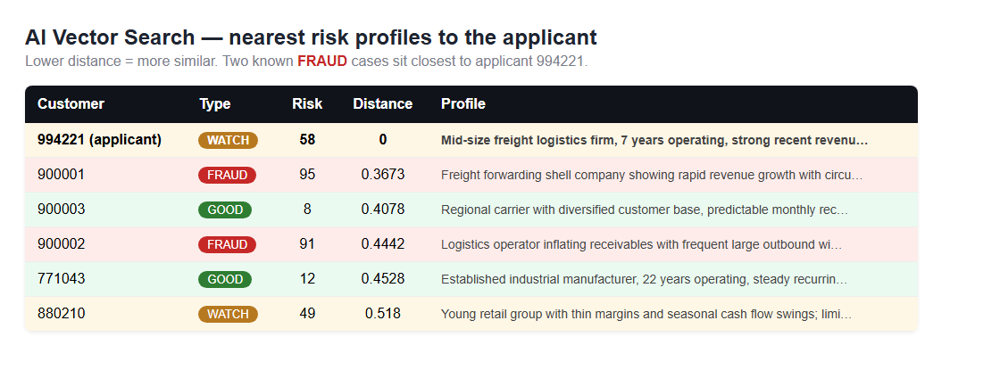
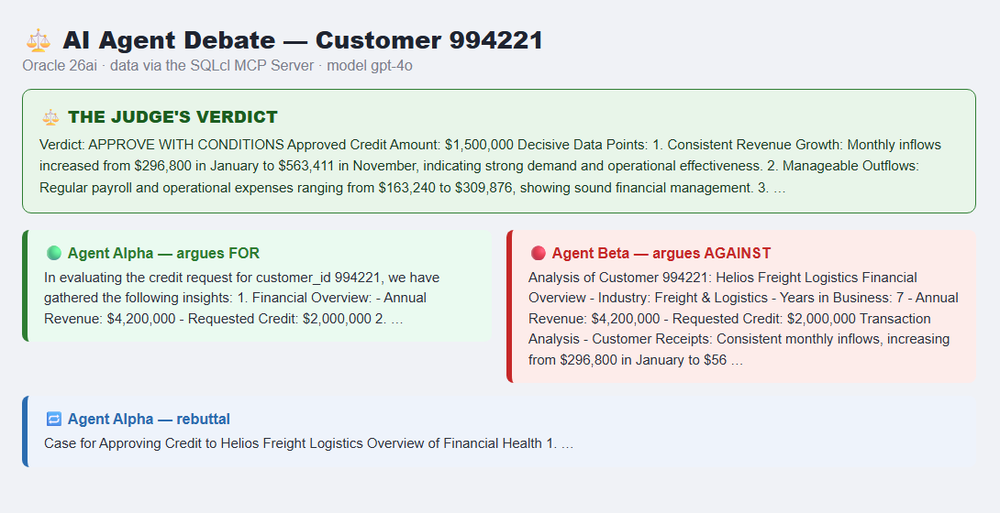

# When AI Agents Argue: Letting Two Bots Debate a Decision Inside Oracle 26ai

*A hands-on look at the new SQLcl MCP Server, AI Vector Search, and a fun way to make AI more trustworthy — all running on Oracle AI Database 26ai.*

---

**📋 At a glance**

- **Tech stack:** Oracle 26ai AI Vector Search · SQLcl MCP Server · OpenAI gpt-4o · Python
- **Database:** Oracle AI Database 26ai — 23.26.2.2.0 (Autonomous Database)
- **Prerequisites:** SQLcl 25.2+ (MCP server), Python 3.10+, an OpenAI API key
- **Best for:** Multi-agent decisioning over your own data — AI agents debate a call (e.g. a credit approval) grounded in vector + relational context.
- **Level:** Intermediate


## The idea in one sentence

Instead of asking *one* AI for an answer, I asked **two AIs to argue** — one in favour, one against — both pulling their evidence live from the same Oracle 26ai database, with a third AI acting as the judge.

It sounds playful, but there's a serious point underneath. A single AI tends to give you one confident answer and quietly skip the awkward facts. Two AIs that *disagree on purpose* drag those awkward facts into the open. And because every fact comes straight from the database, the whole debate is grounded in real data — not made-up "hallucinations".

## Why I'm excited about this on 26ai

As an Oracle ACE, I spend a lot of time with the Oracle AI Database. Two features in particular make this kind of project genuinely easy now:

- **AI Vector Search** — the database can store the "meaning" of text as a vector and find similar items with plain SQL. No separate vector database needed.
- **The SQLcl MCP Server** — a built-in way to let AI tools talk to your database safely, over a standard protocol, without handing them your password.

Put those together and the database stops being a passive box you read from. It becomes a place where AI agents can safely *investigate*.

## First, what is the SQLcl MCP Server?

MCP stands for **Model Context Protocol** — think of it as a universal adapter that lets AI assistants (Claude, Cline, your own scripts) connect to tools. Oracle ships an MCP server right inside **SQLcl 25.2 and later**. You start it with a single command:

```
sql -mcp
```

Once it's running, it offers your AI a small, safe menu of actions:

| Tool | What it does |
| --- | --- |
| `list-connections` | Show your saved database connections |
| `connect` / `disconnect` | Open or close a connection |
| `run-sql` | Run SQL or PL/SQL |
| `run-sqlcl` | Run SQLcl commands |
| `schema-information` | Describe the connected schema |

The key thing: the AI never sees your password. It just asks the MCP server to run things on a connection you've already saved. Every query it runs shows up in the database audit trail like any other session.

## The cast: three AI agents

I gave each agent a personality and pointed all three at the same 26ai database:

- 🟢 **Agent Alpha — the optimist.** Its job is to argue *for* approving a customer's loan. It hunts for healthy cash flow and growth.
- 🔴 **Agent Beta — the sceptic.** Its job is to argue *against*. It looks for red flags and uses vector search to check if the customer resembles known fraud cases.
- ⚖️ **The Judge.** It reads both arguments and the evidence behind them, then makes the final call.

```
  Agent Alpha (for)        Agent Beta (against)
        \                        /
         \                      /
        SQLcl MCP Server  ->  Oracle 26ai
         (run-sql, vector search)
                   |
                   v
              The Judge  ->  final decision
```

## The clever bit: vector search for "gut feeling"

Numbers alone don't catch everything. Sometimes a customer just *feels* like a previous bad actor. That "feeling" is exactly what AI Vector Search captures.

I stored a short written risk profile for each customer, plus historical fraud cases, as vectors in a single table:

```sql
CREATE TABLE risk_profiles (
  customer_id   NUMBER,
  label         VARCHAR2(20),       -- GOOD | WATCH | FRAUD
  risk_score    NUMBER,
  profile_text  VARCHAR2(4000),
  embedding     VECTOR(1536, FLOAT32)
);
```

Then finding the most similar past cases is just SQL — no special add-ons:

```sql
SELECT customer_id, label, risk_score,
       ROUND(VECTOR_DISTANCE(embedding, :query, COSINE), 4) AS distance,
       profile_text
FROM   risk_profiles
ORDER  BY VECTOR_DISTANCE(embedding, :query, COSINE)
FETCH  APPROX FIRST 5 ROWS ONLY;
```

The smaller the `distance`, the more alike two profiles are. So when Agent Beta runs this against a customer, it instantly sees whether that customer looks like a known fraudster.


*AI Vector Search in action — the customer's nearest matches include known FRAUD profiles, with the distance showing just how close.*

## What happened when I ran it

I gave the agents a deliberately tricky applicant — a freight company with **genuine 6%-a-month revenue growth** but also a few suspicious, large, round-number wire transfers. Here's how the debate played out:

> 🟢 **Alpha argued FOR:** "Revenue is growing steadily, monthly inflows are strong, and they look like other healthy borrowers. Approve the full amount."

> 🔴 **Beta argued AGAINST:** "Those round-number wires are a classic red flag — and the vector search shows this customer sits very close to a known fraud profile. Decline, or lend far less."

> ⚖️ **The Judge decided:** "Approve — but with conditions. Reduce the credit to **$1.5M** (not the $2M requested) and monitor the outbound transfers."

That verdict is exactly the kind of balanced, defensible decision you want — and crucially, every point in it traces back to real rows in the database.


*The debate, end to end: Alpha argues for, Beta argues against, and the Judge delivers the verdict — all from data in Oracle 26ai.*

## A few honest tips from building it

If you try this yourself, here are the little things that tripped me up — so they won't trip you:

- **The right SQL.** Oracle's function is `VECTOR_DISTANCE(column, query, COSINE)` with `FETCH APPROX FIRST n ROWS ONLY`. (Ignore any online examples using `@@` — that's PostgreSQL, not Oracle.)
- **The MCP server is SQLcl's.** You start it with `sql -mcp` and a saved connection — there's no magic in-database "enable MCP" procedure to call.
- **Watch the ampersand.** SQLcl treats `&` as a substitution variable, so text like "Freight & Logistics" needs care when scripting inserts.
- **Wrap it in security.** Because the agents only ever run read-only queries through MCP, and everything is audited, you keep full control. Add Oracle's SQL Firewall if you want to lock the allowed statements down even further.

## The takeaway

We usually think of AI and the database as two separate worlds — the AI does the "thinking", the database just stores the data. Oracle 26ai blurs that line. With AI Vector Search and the SQLcl MCP Server, the database becomes a place where AI agents can safely reason over your real, operational data.

And making those agents *argue*? That turned out to be a surprisingly effective way to get a decision I could actually trust.

---

*About the author: **[Your Name]** is an **Oracle ACE** focused on the Oracle AI Database (26ai), AI Vector Search, and the SQLcl MCP Server.*

> ⚠️ This is a learning demo, not financial advice — don't make real lending decisions from a sample database.
